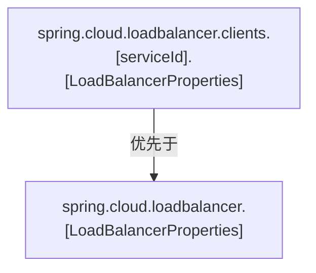
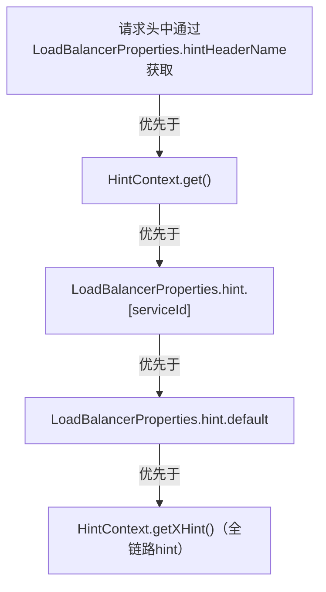
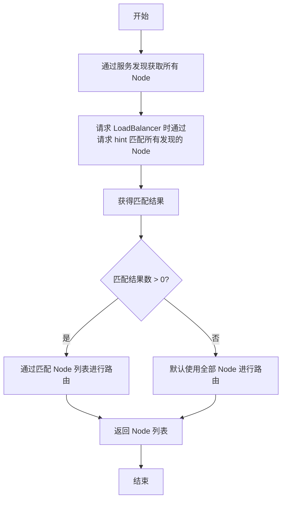
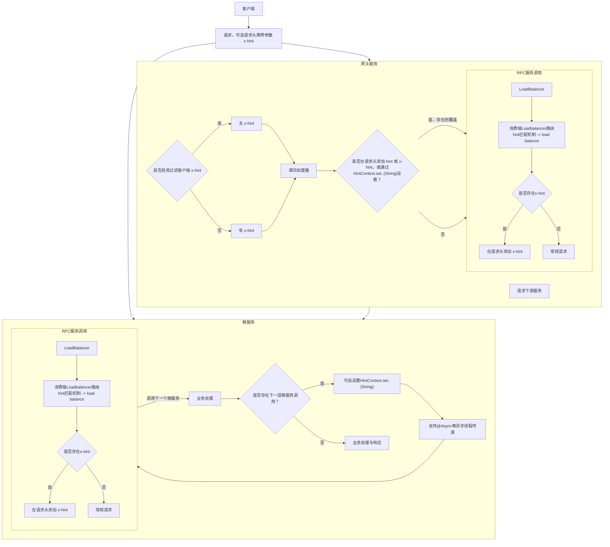
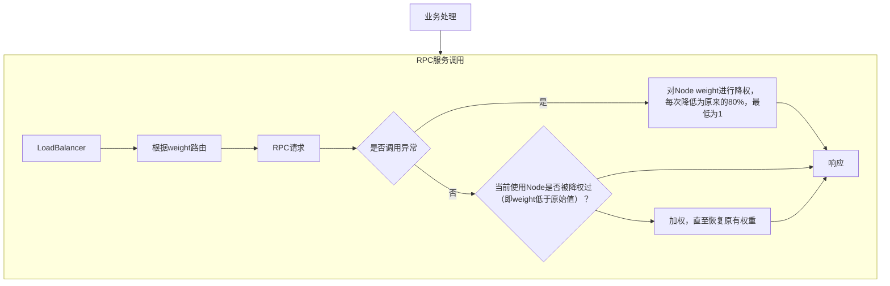

[English](./README.md) | 中文

## 一、spring-cloud-houtu-discovery
作为服务发现扩展，提供对服务在线状态与健康状态增强，其Maven引入配置如下：
```pom
<dependency>
    <groupId>io.github.lujiafa</groupId>
    <artifactId>spring-cloud-houtu-discovery</artifactId>
    <version>3.5.1</version>
</dependency>
```
### 1.1 服务状态上下文
提供状态上下文`ServiceContext`扩展，支持运行时自检测服务状态是否在线（在注册中心），适用于MQ消费、定时任务执行等等内部自运行场景，当明确服务下线时，不再执行业务处理。

### 1.2 健康检查拓展
在健康检查中增加服务状态在线检测，当服务离线时通过`/actuator/health`检测时状态码为503，在某些需要检测的场景较为有用。

## 二、spring-cloud-houtu-loadbalancer
其Maven引入配置如下：
```xml
<dependency>
    <groupId>io.github.lujiafa</groupId>
    <artifactId>spring-cloud-houtu-loadbalancer</artifactId>
    <version>3.5.1</version>
</dependency>
```
### 2.1 Hint概要
##### 2.1.1 消费端LoadBalancerProperties加载优先流程
运行时通过`serviceId`获取`LoadBalancerProperties`, 优先级（从高到低）如下：


##### 2.1.2 消费端Loadbalancer路由hint匹配机制
通过服务发现获取服务Node列表，然后`metadata`中获取`hint`进行，当匹配到节点数大于0时则从匹配Node中路由，否则使用默认全量Node进行路由。
请求方`hint`获取优先级（从高到低）如下：

##### 2.1.3 服务端注册hint配置与修改
服务注册时可以通过注册配置中`metadata`设置`hint`，也可以通过注册中心修改服务注册信息中的`metadata`。

##### 2.1.4 Loadbalancer中Node列表通过hint匹配流程


##### 2.1.5 全链路Hint


### 2.2 权重路由与降级飘移
支持配置权重`weight`(1-100)控制路由节点的权重，权重值越大，优先级越高。
当消费端服务调用服务端某节点发生异常后，会对该节点进行降权降级，从而实现异常飘移。


### 2.3 配合Retry增强
在对业务稳定要求较高环境，可以结合熔断、重试、服务实例降级飘移等方式，提升服务可用性。
实例重试配置如下：
```yaml
spring:
  cloud:
    loadbalancer:
      cache:
        ttl: 5s
      retry:
        retry-on-all-operations: true
        retryable-exceptions:
          - java.net.ConnectException
          - java.net.UnknownHostException
          - java.net.http.HttpConnectTimeoutException
```


## 三、spring-cloud-houtu-feign
作为微服务服务端时，通过`@FeignClient`注解接口，增加`@AutoFeign`注解，该接口实现Bean会根据方法@RequestMapping、@GetMapping、@PostMapping、@PutMapping、@DeleteMapping等等自动发布，无需在单独写Controller类。

其Maven引入配置如下：
```pom
<dependency>
    <groupId>io.github.lujiafa</groupId>
    <artifactId>spring-cloud-houtu-feign</artifactId>
    <version>3.5.1</version>
</dependency>
```

其他增强或配置可以根据业务自行调整，如配置连接超时时间：
```yaml
spring:
  cloud:
    openfeign:
      client:
        config:
          default:
            connect-timeout: 1000
```

## 四、spring-cloud-houtu-alibaba-sentinel
基于 Alibaba Sentinel 提供熔断降级（DegradeRule）、流量控制（FlowRule）、权限控制（AuthorityRule）、系统保护（SystemRule）等规则的 WritableDataSource 委托持久化支持，并内置 Web（SpringMVC/WebFlux）BlockException 处理器。配合 Spring Cloud Alibaba Sentinel Nacos DataSource 可实现规则持久化到 Nacos 配置中心。
其Maven引入配置如下：
```pom
<dependency>
    <groupId>io.github.lujiafa</groupId>
    <artifactId>spring-cloud-houtu-alibaba-sentinel</artifactId>
    <version>3.5.1</version>
</dependency>
```

### 4.1 示例配置中心限流配置
配置dataId为`xx-flow-rule.json`，内容如下：
```json
[
  {
    "resource": "/user/findByUserName",    // 资源名
    "limitApp": "default",                // 来源应用（default表示不区分）
    "grade": 1,                           // 阈值类型（1=QPS）
    "count": 10,                          // 单机阈值（10 QPS）
    "strategy": 0,                        // 流控模式（0=直接）
    "controlBehavior": 0,                 // 流控效果（0=快速失败）
    "clusterMode": false                  // 是否集群
  }
]
```
### 4.2 示例服务配置引入
```yaml
spring:
  cloud:
    sentinel:
      transport:
        dashboard: 127.0.0.1:8858
      datasource:
        nacos:
          server-addr: ${spring.cloud.nacos.server-addr}
        # 作为配置Map的Key，用于协助生成Bean。参考SentinelDataSourceHandler
        flow:
          nacos:
            data-id: ${spring.application.name}-flow-rule.json
            group-id: SENTINEL_GROUP
            type: json
            rule-type: flow
```
