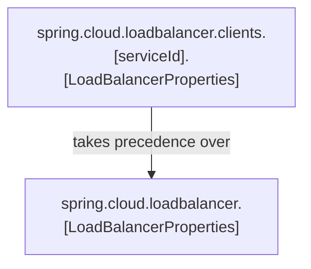
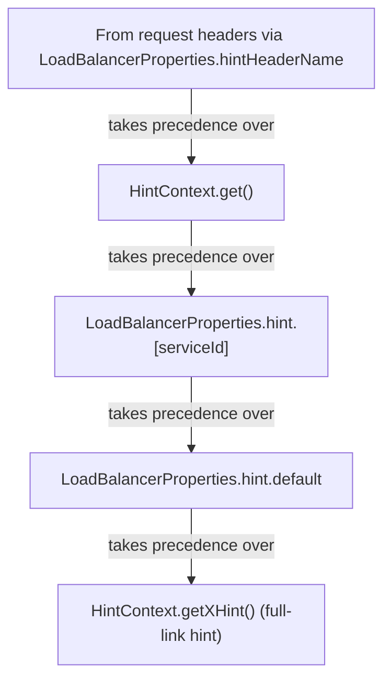
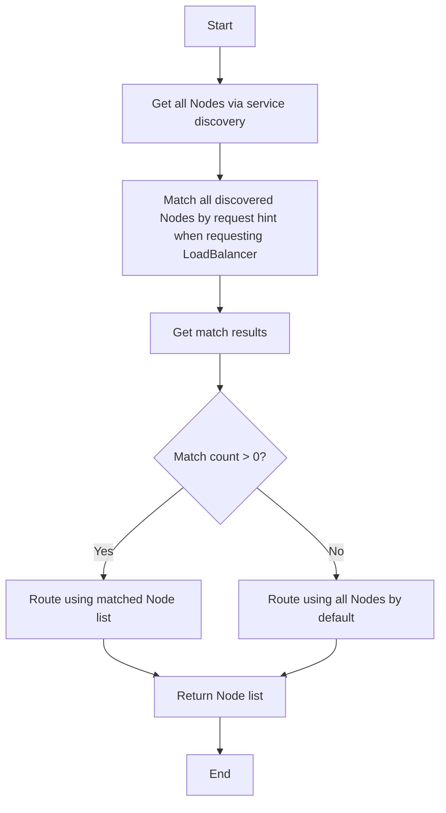
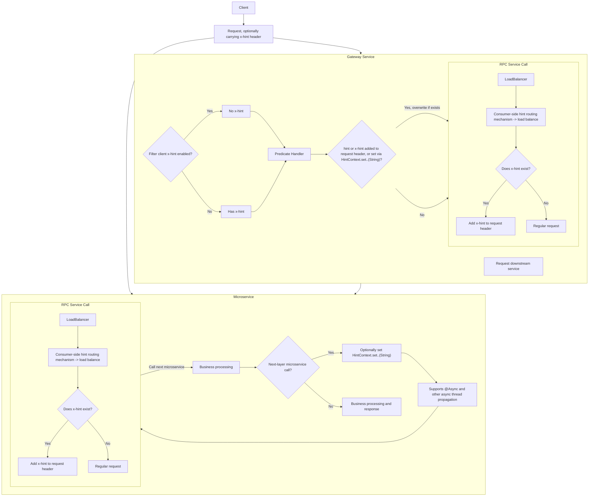
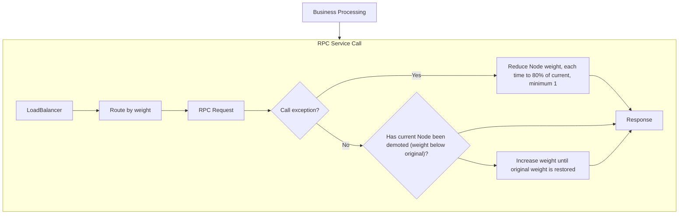

English | [中文](./README-CN.md)

## 1. spring-cloud-houtu-discovery
A service discovery extension that enhances service online status and health status. Maven dependency:
```pom
<dependency>
    <groupId>io.github.lujiafa</groupId>
    <artifactId>spring-cloud-houtu-discovery</artifactId>
    <version>3.5.1</version>
</dependency>
```
### 1.1 Service Status Context
Provides the `ServiceContext` extension for runtime self-checking of whether a service is online (registered in the registry). This is suitable for internal self-running scenarios such as MQ consumption and scheduled task execution — when the service is explicitly offline, business processing is no longer executed.

### 1.2 Health Check Extension
Adds service online status detection to health checks. When a service is offline, the `/actuator/health` endpoint returns a 503 status code, which is useful in scenarios that require status detection.

## 2. spring-cloud-houtu-loadbalancer
Maven dependency:
```xml
<dependency>
    <groupId>io.github.lujiafa</groupId>
    <artifactId>spring-cloud-houtu-loadbalancer</artifactId>
    <version>3.5.1</version>
</dependency>
```
### 2.1 Hint Overview
##### 2.1.1 Consumer-side LoadBalancerProperties Loading Priority
At runtime, `LoadBalancerProperties` are retrieved via `serviceId`. Priority (from high to low):


##### 2.1.2 Consumer-side Loadbalancer Hint Routing Mechanism
The service node list is obtained via service discovery, then `hint` is retrieved from `metadata` for matching. When the number of matched nodes is greater than 0, routing is done from the matched nodes; otherwise, routing uses the full node list by default.
Request-side `hint` retrieval priority (from high to low):

##### 2.1.3 Server-side Hint Registration and Modification
When registering a service, `hint` can be set via `metadata` in the registration configuration, or modified through the registry center's service registration metadata.

##### 2.1.4 Node List Hint Matching Flow in Loadbalancer


##### 2.1.5 Full-link Hint


### 2.2 Weighted Routing and Failover Drift
Supports configuring `weight` (1-100) to control routing node weights — the higher the weight, the higher the priority.
When a consumer-side service call encounters an exception on a specific node, the node's weight is reduced for demotion, achieving exception-driven failover drift.


### 2.3 Enhanced with Retry
In environments with high business stability requirements, you can combine circuit breaking, retry, and service instance failover drift to improve service availability.
Example retry configuration:
```yaml
spring:
  cloud:
    loadbalancer:
      cache:
        ttl: 5s
      retry:
        retry-on-all-operations: true
        retryable-exceptions:
          - java.net.ConnectException
          - java.net.UnknownHostException
          - java.net.http.HttpConnectTimeoutException
```


## 3. spring-cloud-houtu-feign
When serving as a microservice server, by adding the `@AutoFeign` annotation to a `@FeignClient`-annotated interface, the interface implementation bean will be automatically published based on method annotations such as @RequestMapping, @GetMapping, @PostMapping, @PutMapping, @DeleteMapping, etc. — no need to write separate Controller classes.

Maven dependency:
```pom
<dependency>
    <groupId>io.github.lujiafa</groupId>
    <artifactId>spring-cloud-houtu-feign</artifactId>
    <version>3.5.1</version>
</dependency>
```

Other enhancements or configurations can be adjusted according to business needs, such as configuring connection timeout:
```yaml
spring:
  cloud:
    openfeign:
      client:
        config:
          default:
            connect-timeout: 1000
```

## 4. spring-cloud-houtu-alibaba-sentinel
Provides WritableDataSource delegation and persistence support for Alibaba Sentinel rules including circuit breaking (DegradeRule), rate limiting (FlowRule), authority control (AuthorityRule), and system protection (SystemRule), with built-in Web (SpringMVC/WebFlux) BlockException handlers. Combined with the Spring Cloud Alibaba Sentinel Nacos DataSource, rules can be persisted to the Nacos config center.
Maven dependency:
```pom
<dependency>
    <groupId>io.github.lujiafa</groupId>
    <artifactId>spring-cloud-houtu-alibaba-sentinel</artifactId>
    <version>3.5.1</version>
</dependency>
```

### 4.1 Example Rate Limiting Configuration in Config Center
Configure a dataId as `xx-flow-rule.json` with the following content:
```json
[
  {
    "resource": "/user/findByUserName",    // Resource name
    "limitApp": "default",                // Source app (default means no distinction)
    "grade": 1,                           // Threshold type (1=QPS)
    "count": 10,                          // Single-machine threshold (10 QPS)
    "strategy": 0,                        // Flow control mode (0=direct)
    "controlBehavior": 0,                 // Flow control effect (0=fast fail)
    "clusterMode": false                  // Cluster mode
  }
]
```
### 4.2 Example Service Configuration
```yaml
spring:
  cloud:
    sentinel:
      transport:
        dashboard: 127.0.0.1:8858
      datasource:
        nacos:
          server-addr: ${spring.cloud.nacos.server-addr}
        # Key for the config Map, used to assist Bean generation. See SentinelDataSourceHandler
        flow:
          nacos:
            data-id: ${spring.application.name}-flow-rule.json
            group-id: SENTINEL_GROUP
            type: json
            rule-type: flow
```
